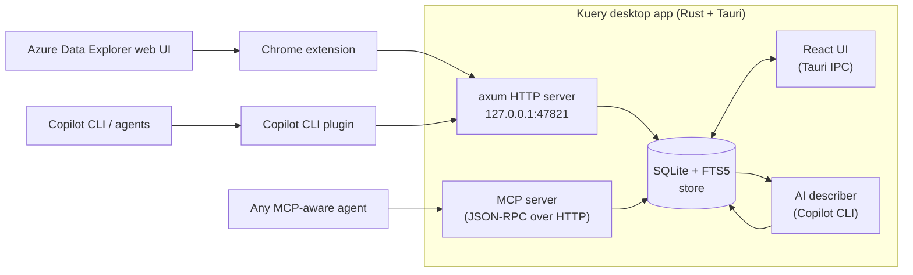

# Kuery

A small macOS app that watches the Kusto queries you run — in
[Azure Data Explorer](https://dataexplorer.azure.com/) and from AI agents
that talk to a Kusto MCP server — and saves them locally so you can search
them, star the good ones, and feed them back to the next agent.

Built with Rust and Tauri 2. Storage, search, UI, AI summaries, and the
MCP server all live in one native process. The browser extension and the
Copilot CLI plugin are thin shims that just forward queries over HTTP.

## Highlights

- **Captures everything you run** — from the Azure Data Explorer web UI
  (via a Chrome extension) and from agents using a Kusto MCP server (via
  a Copilot CLI plugin).
- **Searches everything you've ever run** — SQLite + FTS5 full-text search
  across the query, cluster, database, and an auto-generated description.
- **Smart search** with the GitHub Copilot CLI: ask in plain English ("the
  one that joined PRs to repo nwo last week") and let the agent pick.
- **Re-exposes your history as MCP tools** so the next agent you run can
  recall and re-use anything you've saved.
- **Stays out of the way** — tray-only on macOS, optional start-at-login,
  and a window you can close without losing the background server.

## Getting started

> **macOS only.** Kuery is built and tested on macOS and intentionally
> rejects builds on Linux and Windows. The tray UX, autostart, and file
> paths assume a Mac.

You'll need:

- **Node 20+** and **pnpm**
- **Rust 1.80+** (stable)
- **Xcode command line tools** — `xcode-select --install`

Clone the repo and build a real `.app` you can keep around:

```bash
git clone https://github.com/timrogers/kuery.git
cd kuery
pnpm install
pnpm tauri build
```

The first build takes a few minutes (Rust + every Tauri dep). When it
finishes, drag `src-tauri/target/release/bundle/macos/Kuery.app` into
`/Applications` and launch it from Spotlight or Launchpad. There's also
a `.dmg` in `src-tauri/target/release/bundle/dmg/` if you'd rather
install that way.

To pick up new releases later, `git pull` and run `pnpm install &&
pnpm tauri build` again — overwrite the `.app` in `/Applications`.

### Hook up the capture shims

On first launch, the welcome screen walks you through installing the
Chrome extension (for capturing queries from the Azure Data Explorer web
UI) and the Copilot CLI plugin (for capturing queries from agents) —
copy-pasteable commands and paths included. You can revisit either set
of instructions any time from **Settings**.

### Hacking on Kuery

If you want to make changes, run the dev build instead:

```bash
pnpm tauri dev
```

The React UI hot-reloads and the Rust backend recompiles on save. See
[`AGENTS.md`](AGENTS.md) for repo layout, conventions, and the lint /
test commands CI runs.

## Architecture



- **Rust backend** (`src-tauri/`): SQLite store with FTS5 full-text search,
  an axum HTTP server bound to `127.0.0.1:47821`, an embedded MCP server,
  and a background AI describer.
- **React UI** (`src/`): two-pane query browser with debounce search, star
  toggle, settings, and import/export. Includes a **smart search** mode
  (✨ toggle) that hands a natural-language prompt to the GitHub Copilot
  CLI and returns matching saved queries.
- **Chrome capture shim** (`chrome-extension/`): MV3 extension that
  intercepts Azure Data Explorer query requests and POSTs them to the
  local app.
- **Copilot CLI plugin** (`plugin/`): one-line install (`copilot plugin
  install timrogers/kuery:plugin`). Captures KQL run by the agent via a
  Kusto MCP server, and exposes the local Kuery MCP server (search,
  recall, recent, starred) so the agent can also re-use your saved
  queries.

## HTTP API surface

Bound to `127.0.0.1:47821` only. There is intentionally no read-side HTTP
API — the UI uses Tauri IPC and the MCP server runs in-process — so a
local process can append queries but cannot read or destroy your history.

| Method | Path                      | Description                                          |
|--------|---------------------------|------------------------------------------------------|
| GET    | `/v1/health`              | Liveness check                                       |
| POST   | `/v1/queries`             | Ingest a single query (`{query_text, cluster?, database?, source}`) |
| POST   | `/v1/hooks/copilot-cli`   | `postToolUse` payload sink for the Copilot CLI plugin |
| POST   | `/mcp`                    | JSON-RPC 2.0 MCP endpoint                            |

## MCP tools

Available to any MCP client that can talk to a Streamable HTTP transport at
`http://127.0.0.1:47821/mcp`:

- `search_queries(query, limit?, starred_only?)`
- `get_query(id)`
- `list_recent_queries(limit?)`
- `list_starred_queries(limit?)`

## Debugging

The HTTP API and MCP server log to a persistent file at
`<app data>/logs/kuery.log` (e.g. `~/Library/Application
Support/com.caffeinesoftware.kuery/logs/kuery.log` on macOS). **Settings
→ Logs** has buttons to open the file, reveal it in the file manager, or
copy the path. Set `RUST_LOG=debug` in the environment to crank up
verbosity.

## Background mode

Kuery is designed to run quietly in the background so the capture API and
MCP server are always available.

- On macOS the app runs as a tray-only "accessory" — there is **no Dock
  icon**. Click the menu-bar icon to open the window or quit the app.
- Closing the window just hides it; the server keeps running.
- A **Start at login** option (in the first-run welcome flow and in
  Settings) registers Kuery with the OS so it's running whenever you are.
  When launched at login the window stays hidden until you open it from
  the tray.
- Running the app a second time just focuses the existing window.

## Tests

Backend has a Rust test suite covering the store, ingest validation, MCP
JSON-RPC dispatch, and the legacy import path:

```bash
cd src-tauri && cargo test
```

There is no front-end test suite yet — `pnpm build` runs `tsc` as a type
check.

## License

MIT.
